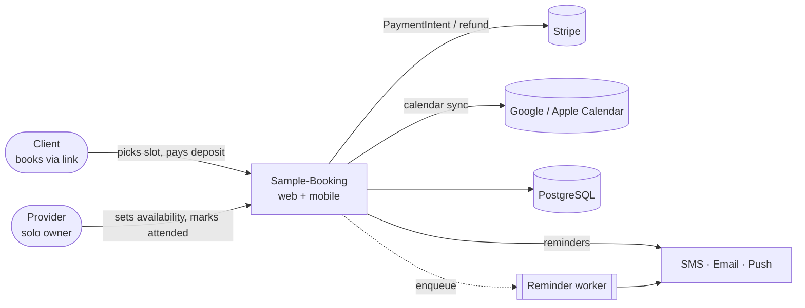

# Context diagram — Sample-Booking (Station 2)

**Surfaces:** customer web booking page · provider mobile app (push) · minimal provider web settings.
No admin portal in v1 (solo). External systems: Stripe, calendar providers, notification channels.
