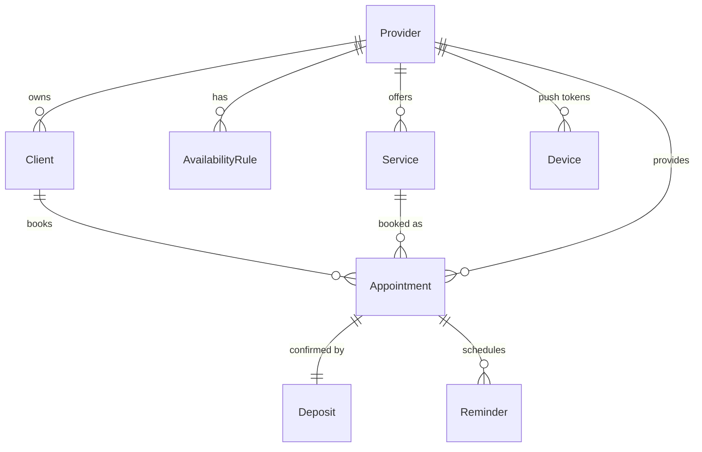

# ERD — Sample-Booking (Station 2, first cut → schema in Station 4)

Notes: `Appointment` carries a `timezone` snapshot (guards cross-tz bugs). One strategy-driven
`Appointment` (type STANDARD|GROUP) rather than a table per service. See `04_DATA_MODEL/schema.prisma`.
