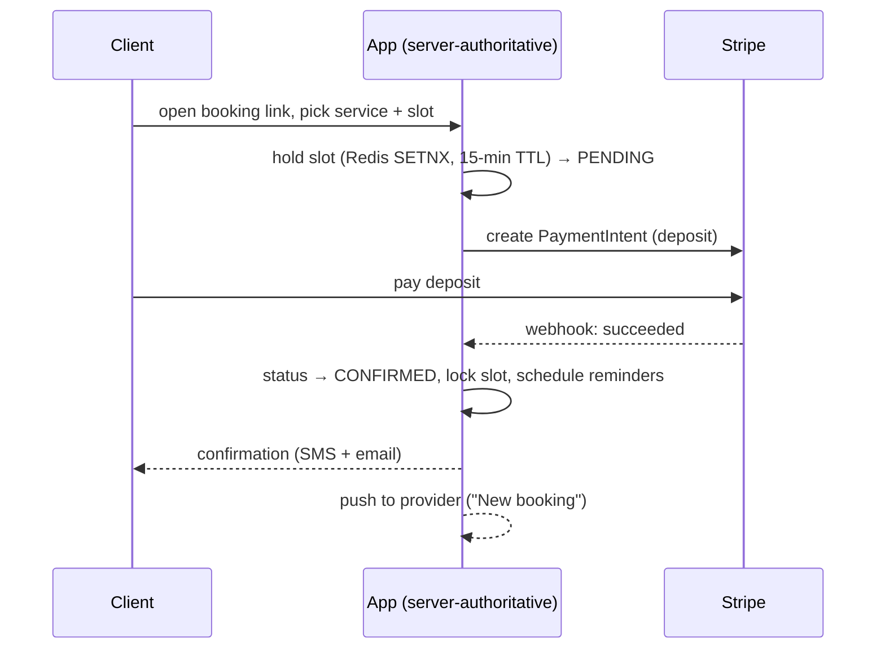

# Core flows — Sample-Booking (Station 2)

## Happy path — book with deposit

## Variant — hold expiry
Client picks slot but doesn't pay within 15 min → job flips PENDING → EXPIRED, releases the slot.

## Variant — attend vs no-show
Provider marks attended → COMPLETED, deposit auto-refunded. Marks no-show → NO_SHOW, deposit retained
per the cancellation policy in effect at booking time.
