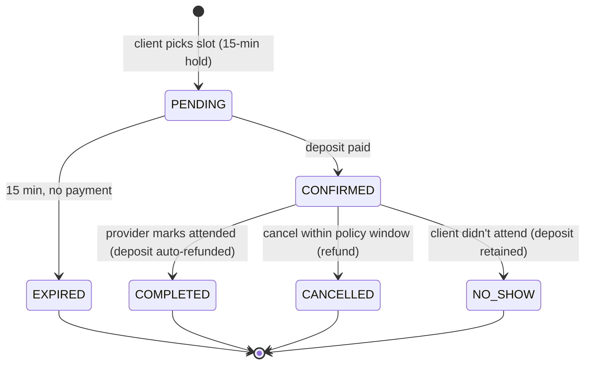

# State diagram — Appointment lifecycle (Station 2)

> Matches the status codes in `03_DICTIONARY`. Every state reachable; no invalid transitions.

**Invariants:** deposit is `HELD` in PENDING/CONFIRMED, `REFUNDED` on COMPLETED/CANCELLED-in-window,
`CAPTURED` on NO_SHOW. A slot is locked only while `CONFIRMED`. Times computed in the provider's timezone.
