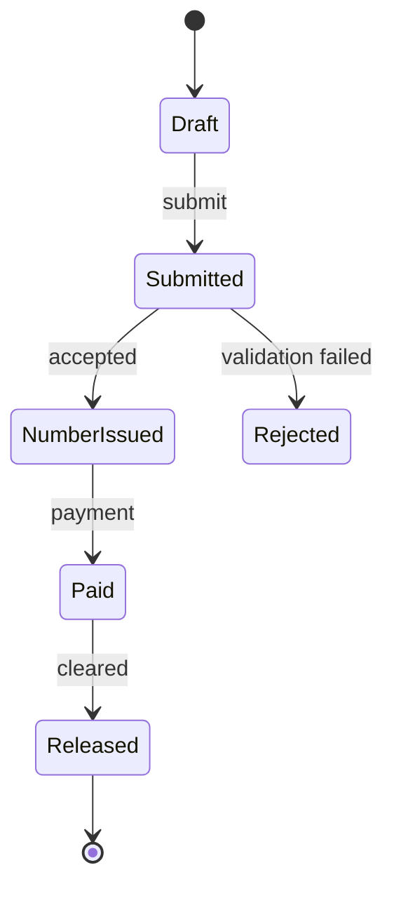

# 02 · DIAGRAMS

Produced at Station 2 from `01_KNOWLEDGE/KNOWLEDGE_INDEX.md`. Default format is **Mermaid** inside
Markdown (diffable, lives in git). Promote to a FigJam canvas when a shared visual helps.

Minimum set (one file each):
- `context.md` — the system + external actors/systems it talks to.
- `flows.md` — the core domain flow: happy path + key variants.
- `state.md` — the lifecycle of any object that moves through statuses (every status reachable; no
  invalid/orphan transitions). Must match the status codes in `03_DICTIONARY`.
- `erd.md` — first-cut entities + relations (feeds Station 4).

**Gate:** every top-level flow from Station 1 has a diagram; every lifecycle status is reachable with
defined transitions.

